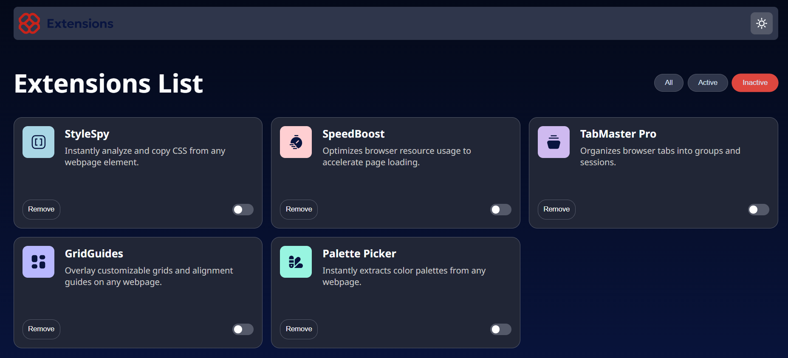

🚀 Browser Extensions Manager UI – Frontend Mentor Solution

This is my solution to the Browser Extensions Manager UI challenge on
Frontend Mentor
.
Frontend Mentor challenges help you improve your coding skills by building realistic projects.

📌 Table of contents

Overview

The challenge

My process

Built with

What I learned

Continued development

Useful resources

Author

📖 Overview
✔ The challenge

Users should be able to:

Toggle extensions between active and inactive states

Filter active and inactive extensions

Remove extensions from the list

Select light or dark theme

View an optimal layout depending on device screen size

See hover and focus states for all interactive elements

🔗 Links

Solution URL: Add your Frontend Mentor solution link here

Live Site URL: https://sarahndom.github.io/Browser-extension/

🧠 My process
🛠 Built with

Semantic HTML5 markup

CSS custom properties

Flexbox

CSS Grid

Mobile-first workflow

Vanilla JavaScript (no frameworks)

📚 What I learned

Working on this project improved my skills in:

✔ DOM manipulation

Creating dynamic UI behavior such as toggling, filtering, and removing extension cards.

✔ State filtering logic
filterButtons.forEach(button => {
  button.addEventListener("click", () => {
    const filter = button.textContent.trim();

    cards.forEach(card => {
      const isActive = card.querySelector("input[type=checkbox]").checked;

      card.style.display =
        filter === "All" ||
        (filter === "Active" && isActive) ||
        (filter === "Inactive" && !isActive)
          ? "flex"
          : "none";
    });
  });
});

✔ Theme switching

Using CSS variables + JavaScript to toggle between light and dark themes.

✔ Cleaner component layout

Using CSS Grid to create a scalable and responsive extension grid.

🔮 Continued development

In future projects, I want to continue improving:

More advanced state management patterns

Creating reusable UI components

Smooth dark/light mode transitions

Using localStorage to persist theme and extension state

📘 Useful resources

MDN Web Docs – https://developer.mozilla.org/

CSS Tricks – https://css-tricks.com/

Frontend Mentor Community – https://www.frontendmentor.io/community

✨ Author

Frontend Mentor: @Sarahndom

GitHub: https://github.com/Sarahndom/Browser-extension.git